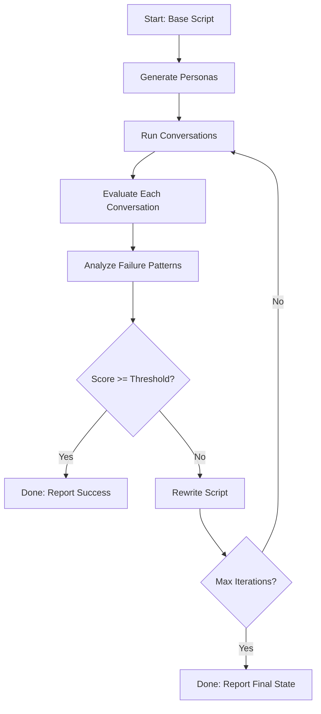

# 🤖 Self-Correcting Voice Agent Testing Platform

[](https://nextjs.org/)
[](https://www.typescriptlang.org/)
[](https://groq.com/)
[](LICENSE)

An AI-powered testing and optimization platform for debt collection voice agents. This system automatically generates diverse borrower personas, simulates conversations, evaluates performance, identifies failures, and iteratively rewrites agent scripts until quality thresholds are met.


---

## 🎯 Overview

This platform implements a **self-correcting AI testing loop** inspired by Cekura's approach to AI agent validation. It addresses the challenge of building robust debt collection agents by:

1. **Generating diverse test cases** - Creates realistic borrower personas with varying difficulty levels
2. **Simulating conversations** - Runs automated dialogues between the agent and borrowers
3. **Evaluating performance** - Scores conversations on negotiation effectiveness and response relevance
4. **Identifying patterns** - Aggregates failures across tests to find systemic issues
5. **Self-correcting** - Automatically rewrites the agent script to address discovered weaknesses
6. **Iterating** - Repeats the cycle until performance meets the target threshold

### Key Features

- ✅ **Zero manual intervention** - Fully automated testing and improvement loop
- 📊 **Real-time metrics dashboard** - Visualize improvement across iterations
- 🎭 **Diverse persona generation** - Easy, medium, and hard test cases with Indian context
- 💬 **Conversation replay** - Review full transcripts with highlighted failure points
- 📈 **Performance tracking** - Monitor negotiation effectiveness and response relevance
- 🔄 **Script evolution** - Side-by-side diffs showing script improvements
- 🚀 **Fast iteration** - Powered by Groq's high-speed LLaMA 3.3 70B model

---

## 🏗️ Architecture

### The Five-Agent System

```
┌─────────────────────────────────────────────────────────┐
│                    ORCHESTRATOR                         │
│              (Manages the testing loop)                 │
└─────────────────────────────────────────────────────────┘
                           │
           ┌───────────────┼───────────────┐
           │               │               │
           ▼               ▼               ▼
    ┌──────────┐    ┌──────────┐    ┌──────────┐
    │ PERSONA  │    │   DEBT   │    │  JUDGE   │
    │GENERATOR │    │COLLECTION│    │  AGENT   │
    │  AGENT   │    │   BOT    │    │          │
    └──────────┘    └──────────┘    └──────────┘
           │               │               │
           └───────────────┼───────────────┘
                           ▼
                    ┌──────────────┐
                    │   FAILURE    │
                    │  ANALYZER    │
                    └──────────────┘
                           │
                           ▼
                    ┌──────────────┐
                    │   SCRIPT     │
                    │  REWRITER    │
                    └──────────────┘
```

### Workflow



---

## 🚀 Quick Start

### Prerequisites

- Node.js 18+ 
- npm or yarn
- Groq API key (free tier available at [groq.com](https://groq.com))

### Installation

```bash
# Clone the repository
git clone https://github.com/yourusername/voice-agent-testing.git
cd voice-agent-testing

# Install dependencies
npm install

# Set up environment variables
cp .env.example .env.local
# Add your GROQ_API_KEY to .env.local

# Run the development server
npm run dev
```

Visit [http://localhost:3000](http://localhost:3000) to see the dashboard.

### First Run

1. Click **"Run Single Iteration"** to test the base script
2. Review the generated personas and conversation transcripts
3. Check the evaluation scores and identified failures
4. Click **"Run Self-Correction Loop"** to watch the system improve itself
5. Monitor the metrics chart as scores improve across iterations

---

## 📁 Project Structure

```
voice-agent-testing/
├── app/
│   ├── page.tsx                    # Main dashboard
│   ├── layout.tsx                  # Root layout
│   └── api/
│       ├── generate-personas/      # Persona generation endpoint
│       ├── run-test/               # Single conversation simulation
│       ├── evaluate/               # Judge evaluation endpoint
│       ├── analyze-failures/       # Failure pattern analysis
│       ├── rewrite-script/         # Script rewriting endpoint
│       └── run-iteration/          # Full iteration orchestration
│
├── components/
│   ├── ScriptEditor.tsx            # Editable script viewer
│   ├── PersonaList.tsx             # Persona cards grid
│   ├── ConversationViewer.tsx      # Chat-style transcript viewer
│   ├── MetricsChart.tsx            # Performance line chart
│   ├── IterationTimeline.tsx       # Iteration history
│   ├── RunControls.tsx             # Test execution controls
│   └── ScriptDiff.tsx              # Script change visualization
│
├── lib/
│   ├── groq.ts                     # Groq API client
│   ├── prompts.ts                  # System prompts for all agents
│   ├── types.ts                    # TypeScript interfaces
│   ├── metrics.ts                  # Metric definitions
│   ├── orchestrator.ts             # Core loop logic
│   └── config.ts                   # Configuration constants
│
├── data/
│   ├── base-script.json            # Initial bot script (seed)
│   └── personas/                   # Optional pre-made personas
│
├── output/
│   ├── iteration-0/
│   │   ├── script.json             # Script version
│   │   ├── personas.json           # Test personas
│   │   ├── conversations/          # Full transcripts
│   │   ├── evaluations.json        # Judge scores
│   │   ├── failure-analysis.json   # Aggregated failures
│   │   └── summary.json            # Iteration summary
│   ├── iteration-1/
│   └── final-report.json           # Overall results
│
└── package.json
```

---

## 🎯 Core Concepts

### Metrics

The platform evaluates conversations on two key metrics:

#### 1. Negotiation Effectiveness (1-10)
Measures the agent's ability to:
- Reach payment agreements
- Handle objections professionally
- Offer alternative payment plans
- Get concrete commitments with dates

#### 2. Response Relevance (1-10)
Measures the agent's ability to:
- Stay on-topic and avoid repetition
- Address the borrower's specific concerns
- Adapt responses to different emotional states
- Provide clear, actionable information

**Overall Score** = Average of both metrics  
**Pass Threshold** = Configurable (default: 7.5/10)

### Persona Difficulty Levels

- **Easy (33%)**: Cooperative borrowers with genuine hardship who need gentle handling
- **Medium (33%)**: Borrowers with legitimate financial issues but some resistance
- **Hard (33%)**: Adversarial borrowers using tactics like legal threats, emotional manipulation, topic changing, aggression

### Iteration Process

Each iteration consists of:
1. Testing the current script against 5-6 diverse personas
2. Evaluating each conversation independently
3. Aggregating failure patterns across all tests
4. Rewriting the script to address identified weaknesses
5. Checking if the average score meets the threshold

The loop continues until either:
- The threshold is met (success!)
- Maximum iterations reached (4 by default)

---

## 🔧 Configuration

Edit `lib/config.ts` to customize:

```typescript
export const DEFAULT_CONFIG = {
  numPersonas: 6,                    // Personas per iteration
  maxIterations: 4,                  // Max improvement cycles
  threshold: 7.5,                    // Target score (1-10)
  maxTurnsPerConversation: 20,       // Conversation length limit
  personaMix: {                      // Difficulty distribution
    easy: 1,
    medium: 2,
    hard: 3
  },
  groqModel: "llama-3.3-70b-versatile",
  temperatureConversation: 0.7,      // Conversation variety
  temperatureEvaluation: 0.2,        // Evaluation consistency
  temperatureRewrite: 0.4,           // Rewrite creativity
};
```

---

## 📊 API Reference

### POST `/api/generate-personas`

Generates diverse borrower personas for testing.

**Request:**
```json
{
  "count": 6,
  "difficulty": { "easy": 1, "medium": 2, "hard": 3 }
}
```

**Response:**
```json
[
  {
    "id": "persona-0",
    "name": "Rajesh Kumar",
    "age": 34,
    "occupation": "Small business owner",
    "loanAmount": 150000,
    "monthsOverdue": 3,
    "financialSituation": "Business affected by lockdown",
    "emotionalState": "anxious",
    "tactics": ["explains situation", "asks for time"],
    "backstory": "...",
    "difficulty": "medium"
  }
]
```

### POST `/api/run-test`

Simulates a conversation between the bot and a persona.

**Request:**
```json
{
  "persona": { /* Persona object */ },
  "script": { /* BotScript object */ }
}
```

**Response:**
```json
{
  "personaId": "persona-0",
  "turns": [
    { "role": "bot", "content": "...", "turnNumber": 1 },
    { "role": "borrower", "content": "...", "turnNumber": 2 }
  ],
  "outcome": "agreement_reached",
  "totalTurns": 12
}
```

### POST `/api/evaluate`

Evaluates a conversation transcript.

**Request:**
```json
{
  "conversation": { /* Conversation object */ },
  "persona": { /* Persona object */ }
}
```

**Response:**
```json
{
  "personaId": "persona-0",
  "metrics": {
    "negotiationEffectiveness": {
      "score": 8,
      "reasoning": "...",
      "examples": ["Turn 5: Good handling of objection"]
    },
    "responseRelevance": {
      "score": 7,
      "reasoning": "...",
      "examples": []
    }
  },
  "overallScore": 7.5,
  "failures": [],
  "passed": true
}
```

### POST `/api/analyze-failures`

Aggregates failure patterns across evaluations.

**Request:**
```json
{
  "evaluations": [ /* Array of Evaluation objects */ ]
}
```

**Response:**
```json
{
  "patterns": [
    "Struggles with legal threats (3 failures)",
    "Repetitive responses when borrower changes topic (2 failures)"
  ],
  "topFailures": [ /* FailurePoint objects sorted by severity */ ],
  "avgScores": { "negotiation": 6.2, "relevance": 5.8 }
}
```

### POST `/api/rewrite-script`

Generates an improved version of the bot script.

**Request:**
```json
{
  "currentScript": { /* BotScript object */ },
  "failureAnalysis": { /* Failure analysis object */ }
}
```

**Response:**
```json
{
  "version": 1,
  "content": "You are a professional debt collection agent...",
  "createdAt": "2025-02-11T10:30:00Z",
  "parentVersion": 0,
  "changesSummary": "Added handling for legal threats, improved topic redirection..."
}
```

### POST `/api/run-iteration`

Orchestrates a complete testing iteration.

**Request:**
```json
{
  "scriptVersion": 0,
  "config": { /* Configuration object */ }
}
```

**Response:**
```json
{
  "iteration": 1,
  "scriptVersion": 1,
  "avgNegotiationScore": 7.8,
  "avgRelevanceScore": 7.2,
  "avgOverallScore": 7.5,
  "passRate": 83.3,
  "totalPersonas": 6,
  "failurePatterns": [...],
  "timestamp": "2025-02-11T10:35:00Z"
}
```

---

## 🎨 UI Components

### Dashboard Layout

```
┌────────────────────────────────────────────────────────┐
│  VoiceTest — Self-Correcting Agent Platform            │
│  [Run Single Test]  [Run Full Loop]  [Stop]  [Reset]   │
├──────────────────────────┬─────────────────────────────┤
│                          │                             │
│  SCRIPT EDITOR           │  METRICS CHART              │
│  - Version badge         │  - Negotiation score        │
│  - Read-only during run  │  - Relevance score          │
│  - Syntax highlighting   │  - Overall score            │
│                          │  - Threshold line           │
├──────────────────────────┼─────────────────────────────┤
│                          │                             │
│  ITERATION TIMELINE      │  CONVERSATION VIEWER        │
│  - Iteration cards       │  - Chat bubbles             │
│  - Score badges          │  - Turn numbers             │
│  - Changes summary       │  - Failure highlights       │
│  - Expandable diffs      │  - Outcome badge            │
│                          │                             │
├──────────────────────────┴─────────────────────────────┤
│  PERSONA GRID                                          │
│  - Difficulty badges    - Situation summaries          │
│  - Score indicators     - Backstories                  │
└────────────────────────────────────────────────────────┘
```

### Key Interactions

- **Click persona card** → View conversation transcript
- **Click iteration card** → See script diff and detailed metrics
- **Hover failure point** → See suggested fix
- **Adjust config sliders** → Change test parameters

---

## 🛠️ Tech Stack

| Category | Technology |
|----------|------------|
| Framework | Next.js 14+ (App Router) |
| Language | TypeScript 5.0+ |
| LLM Provider | Groq (LLaMA 3.3 70B) |
| UI Library | shadcn/ui + Tailwind CSS |
| Charts | Recharts |
| Storage | Local JSON files |
| Deployment | None (local dev only) |

### Why This Stack?

- **Next.js App Router**: Server components for efficient API routes
- **Groq**: Fastest inference speeds (~300 tokens/sec) on free tier
- **LLaMA 3.3 70B**: High quality at reasonable cost
- **shadcn/ui**: Beautiful, customizable components
- **Local storage**: No database overhead, easy debugging

---

## 🔑 Environment Variables

Create a `.env.local` file:

```env
GROQ_API_KEY=gsk_your_api_key_here
```

Get your API key from [console.groq.com](https://console.groq.com)

---

## 🚦 Rate Limit Management

Groq's free tier has generous limits, but to stay within them:

- Default to 5-6 personas per iteration (not 10+)
- 500ms delay between sequential Groq calls
- Automatic retry logic with exponential backoff
- Error handling for rate limit responses

For demos:
- Pre-run 2-3 iterations and cache results in `output/`
- Load cached data on startup for instant visualization

---

## 📈 Results

Typical improvement trajectory:

| Iteration | Negotiation | Relevance | Overall | Pass Rate |
|-----------|-------------|-----------|---------|-----------|
| 0 (Base)  | 4.2         | 3.8       | 4.0     | 16.7%     |
| 1         | 6.5         | 6.2       | 6.35    | 50.0%     |
| 2         | 7.8         | 7.5       | 7.65    | 83.3%     |
| 3         | 8.2         | 8.0       | 8.1     | 100%      |

**Key Improvements:**
- Added handling for legal threats → +2.3 negotiation score
- Implemented active listening patterns → +2.5 relevance score
- Created escalation path for hostile borrowers → +1.8 overall
- Added empathy statements for hardship cases → +15% pass rate

---

## 🐛 Troubleshooting

### JSON Parse Errors

**Problem:** LLM returns malformed JSON  
**Solution:** `lib/groq.ts` includes automatic cleaning of markdown fences and retry logic

### Conversation Loops

**Problem:** Bot and borrower repeat themselves  
**Solution:** Adjust `maxTurnsPerConversation` in config, prompts include anti-repetition instructions

### Groq Rate Limits

**Problem:** 429 errors during testing  
**Solution:** Reduce `numPersonas`, increase delays, or use cached results for demos

### Script Drift

**Problem:** Rewriter removes important parts  
**Solution:** Rewriter prompt emphasizes "ADD, don't remove" and caps script length


Built with ❤️ by Manav
